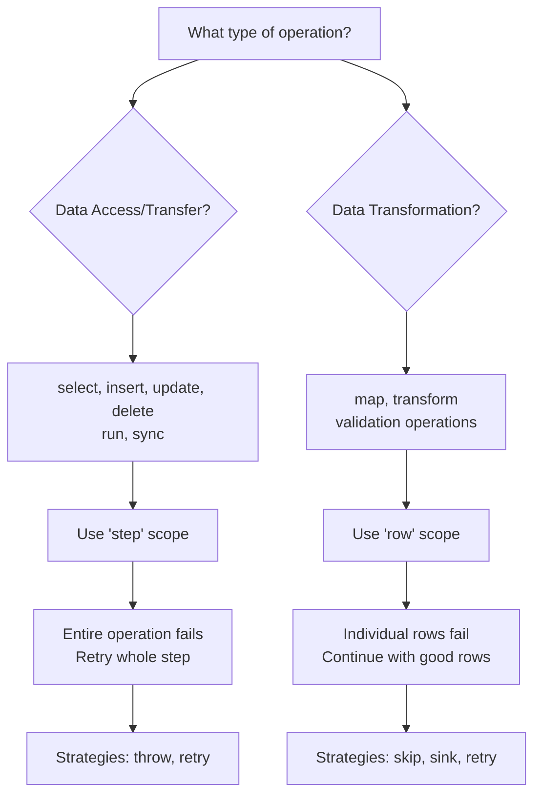

# On Error Step Handling Specification

## Overview

Universal error handling provides robust failure management for all plan steps in Metal. This feature allows configurable error strategies at both plan-level (global defaults) and step-level (specific overrides).

## Configuration Structure

Error handling can be configured at three levels:

| Level          | Description                                           |
| -------------- | ----------------------------------------------------- |
| **Plan-Level** | Default for entire plan execution.                    |
| **Step-Level** | Specific to an individual step. Overrides plan-level. |
| **Row-Level**  | For individual data transformation rows.              |

### Plan-Level Error Handling

Error handling for entire plan execution failures.

```yaml
plans:
  my-plan:
    on-error:
      strategy: throw
      scope: plan
```

### Step-Level Error Handling

Error handling for individual data processing steps (select, insert, update, delete, etc.).

```yaml
plans:
  my-plan:
    steps:
      - select:
          schema: source
          entity: data
          on-error:
            strategy: skip
            scope: step
```

### Row-Level Error Handling

Error handling for individual data transformation rows (map, transform, validation operations).

```yaml
plans:
  my-plan:
    steps:
      - list-entities:
          schema: my-schema
          on-error:
            strategy: sink
            scope: row
            sink:
              schema: errors
              entity: transform_failures
```

## Supported Steps

The `on-error` parameter is supported by data processing steps:

| Step Command        | Description                      | Support Level |
| ------------------- | -------------------------------- | ------------- |
| `select`            | Select data from an entity       | Full Support  |
| `insert`            | Insert data to an entity         | Full Support  |
| `delete`            | Delete data from an entity       | Full Support  |
| `update`            | Update data of an entity         | Full Support  |
| `join`              | Perform data joins               | Full Support  |
| `sort`              | Sort data                        | Full Support  |
| `run`               | Run AI Engine operations         | Full Support  |
| `sync`              | Synchronize data between sources | Full Support  |
| `anonymize`         | Anonymize data fields            | Full Support  |
| `remove-duplicates` | Remove duplicate rows            | Full Support  |
| `list-entities`     | List entities in schema          | Full Support  |
| `pick`              | Keep specific fields             | Full Support  |
| `omit`              | Remove specific fields           | Full Support  |
| `map`               | Transform data with JavaScript   | Full Support  |

### Not Supported

Control/utility steps do not support error handling:

| Step Command | Reason                   |
| ------------ | ------------------------ |
| `debug`      | Debug control step       |
| `break`      | Execution control step   |
| `set-var`    | Variable assignment step |

## Error Strategies

### `throw`

Default behavior. Stops plan execution and throws the error.

**Example:**

```yaml
on-error:
  strategy: throw
  scope: step
```

### `skip`

Skips the failed operation and continues with next steps. For row-level operations, skips problematic rows.

**Example:**

```yaml
on-error:
  strategy: skip
  scope: step
```

### `sink`

Moves failed data to a specified error destination for later analysis and reprocessing.

**Parameters:**

| Parameter            | Type    | Required | Description                                             |
| -------------------- | ------- | -------- | ------------------------------------------------------- |
| `scope`              | String  | N        | Error scope: `step` or `row`                            |
| `sink.schema`        | String  | Y        | Error destination schema                                |
| `sink.entity`        | String  | Y        | Error destination entity                                |
| `sink.include-error` | Boolean | N        | Include error details in sink (default: `true`)         |
| `sink.error-field`   | String  | N        | Field name for error details (default: `error-details`) |

**Example:**

```yaml
on-error:
  strategy: sink
  scope: row
  sink:
    schema: errors
    entity: transform_failures
    include-error: true
    error-field: error_message
```

### `retry`

Attempts to retry the failed operation, then applies a fallback strategy after retries.

**Parameters:**

| Parameter         | Type    | Required | Description                                                                     |
| ----------------- | ------- | -------- | ------------------------------------------------------------------------------- |
| `scope`           | String  | N        | Error scope: `step` or `row` (default varies by step type)                      |
| `retry.attempts`  | Integer | Y        | Maximum retry attempts (default: `3`)                                           |
| `retry.delay`     | Integer | N        | Delay between retries in milliseconds (default: `1000`)                         |
| `retry.backoff`   | String  | N        | Backoff strategy: `fixed`, `linear`, `exponential` (default: `fixed`)           |
| `retry.max-delay` | Integer | N        | Maximum delay for exponential/linear backoff in milliseconds (default: `30000`) |
| `retry.after-retries`      | String  | N        | Fallback strategy after retries: `throw`, `sink`, or `skip` (default: `throw`)  |
| `sink.*`          | Varies  | N        | Sink configuration (required when `retry.after-retries: sink`)                           |

**Example:**

```yaml
on-error:
  strategy: retry
  scope: step
  retry:
    attempts: 5
    delay: 2000
    backoff: exponential
    max-delay: 60000
    after-retries: sink
  sink:
    schema: errors
    entity: retry_failures
```

## Error Scopes

The `scope` parameter determines whether error handling applies to the entire step or individual rows:

### Choosing the Right Scope



**Use `step` scope when:**

- Performing data access operations (select, insert, update, delete)
- Running external operations (AI engines, sync)
- Connection or infrastructure failures affect the entire operation
- You need to retry the complete operation

**Use `row` scope when:**

- Transforming or validating individual data rows
- Data quality issues affect only some rows
- You want to continue processing valid rows
- You need to capture specific problematic rows for analysis

### `step` Scope

Error handling applies to the entire step operation. If the step fails, the whole step is retried/sunk/failed.

**Default for:** `select`, `insert`, `update`, `delete`, `run`, `sync`

**Strategy Compatibility:**

| Strategy | Compatible with Step Scope | Reason                                              |
| -------- | -------------------------- | --------------------------------------------------- |
| `throw`  | ✅ Yes                     | Stops execution on step failure                     |
| `skip`   | ❌ No                      | Skipping entire step doesn't make sense             |
| `sink`   | ❌ No                      | Sinking entire step data is not practical           |
| `retry`  | ✅ Yes                     | Retries failed step, then applies fallback strategy |

### `row` Scope

Error handling applies to individual rows within the step. Failed rows are handled separately, successful rows continue.

**Default for:** `map`, `transform`

**Behavior:**

- Row validation error → Only that row fails
- Transformation error → Only that row fails
- Data format error → Only that row fails
- Retry applies to individual rows

**Strategy Compatibility:**

| Strategy | Compatible with Row Scope | Reason                                              |
| -------- | ------------------------- | --------------------------------------------------- |
| `throw`  | ❌ No                     | Would stop processing all rows                      |
| `skip`   | ✅ Yes                    | Skips failed rows, continues processing             |
| `sink`   | ✅ Yes                    | Sinks failed rows, continues processing             |
| `retry`  | ✅ Yes                    | Retries failed rows, then applies fallback strategy |

## Error Context Variables

When errors occur, the following context variables are available for error handling:

| Variable           | Description               | Available In                          |
| ------------------ | ------------------------- | ------------------------------------- |
| `$error.message`   | Error message text        | All strategies and scopes             |
| `$error.type`      | Error type/classification | All strategies and scopes             |
| `$error.step`      | Step that failed          | All strategies and scopes             |
| `$error.timestamp` | When error occurred       | All strategies and scopes             |
| `$error.attempt`   | Current retry attempt     | Retry strategies (step and row scope) |

## Error Sink Schema

Error sink destinations automatically receive these fields:

| Field           | Type         | Description                                                             |
| --------------- | ------------ | ----------------------------------------------------------------------- |
| `original_data` | Object/Array | The data that failed processing (varies by step type)                   |
| `error-details` | Object       | Error information matching context variables (if `include-error: true`) |
| `step_info`     | Object       | Step context (step index, command, etc.)                                |
| `timestamp`     | String       | When the error occurred                                                 |
| `attempt`       | Integer      | Retry attempt number (if applicable)                                    |

### `error-details` Field Structure

The `error-details` field contains the same structure as the context variables:

```json
{
  "error-details": {
    "message": "Invalid email format",
    "type": "validation-error",
    "step": "map",
    "timestamp": "2024-01-15T10:30:45.123Z",
    "attempt": 2
  }
}
```

**Mapping to context variables:**

- `error-details.message` → `$error.message`
- `error-details.type` → `$error.type`
- `error-details.step` → `$error.step`
- `error-details.timestamp` → `$error.timestamp`
- `error-details.attempt` → `$error.attempt`

### Implementation Examples

### Step Scope vs Row Scope Comparison

#### Step Scope Example (Data Access)

```yaml
plans:
  data-pipeline:
    steps:
      - select:
          schema: source
          entity: customers
          on-error:
            strategy: retry
            retry:
              attempts: 3
              delay: 1000
              after-retries: throw

      # If database connection fails, entire select operation
      # is retried 3 times, then execution stops
```

#### Row Scope Example (Data Transformation)

```yaml
plans:
  data-pipeline:
    steps:
      - map:
          script: |
            $row.email = $row.email.toLowerCase().trim();
            if (!$row.email.includes('@')) {
              throw new Error('Invalid email format');
            }
            return $row;
          on-error:
            strategy: sink
            scope: row # Default for map
            sink:
              schema: errors
              entity: invalid_emails

      # Individual rows with invalid emails are sunk,
      # valid rows continue processing
```

### Basic Error Handling

```yaml
plans:
  data-pipeline:
    steps:
      - select:
          schema: source
          entity: raw_data
          on-error:
            strategy: skip

      - map:
          script: |
            $row.processed_at = new Date().toISOString();
            return $row;
          on-error:
            strategy: sink
            sink:
              schema: errors
              entity: map_failures

      - insert:
          schema: target
          entity: processed_data
          on-error:
            strategy: retry
            retry:
              attempts: 3
              delay: 1000
              after-retries: throw
```

### Advanced Error Handling with Retry and Sink

```yaml
plans:
  critical-pipeline:
    steps:
      - select:
          schema: external_api
          entity: data
          on-error:
            strategy: retry
            retry:
              attempts: 5
              delay: 2000
              backoff: exponential
              max-delay: 60000
              after-retries: sink
            sink:
              schema: errors
              entity: api_failures
              include-error: true

      - map:
          script: |
            $row.normalized = $row.value.toLowerCase().trim();
            return $row;
          on-error:
            strategy: skip
```
