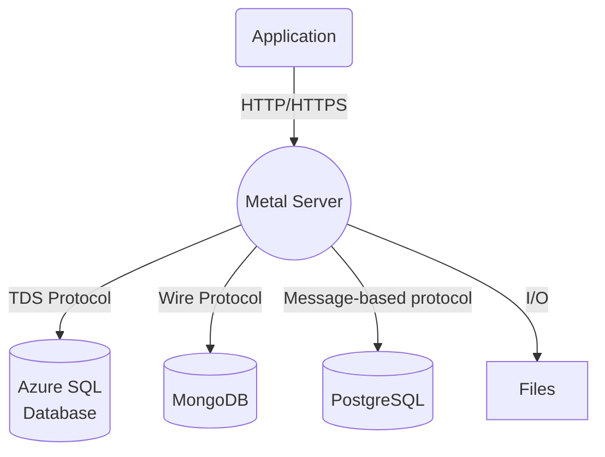

#   `version 0.2`

## Overview

Metal, abbreviated as **M**iddleware, **E**xtraction, **T**ransformation, **A**rtificial Intelligence and **L**oad, represents a cutting-edge technology that seamlessly integrates the capabilities of artificial intelligence with database middleware and ETL (Extraction, Transformation, Load) functionalities, ushering in a new era of enhanced performance. By infusing artificial intelligence, Metal elevates these functions, imbuing them with automation and intelligent decision-making capabilities.

The central mission of Metal remains unchanged: to streamline and modernize CRUD operations and data transformation tasks across a spectrum of SQL and NoSQL databases. However, with the infusion of artificial intelligence, Metal transcends traditional boundaries, introducing a paradigm shift in data management and processing.

Serving as a sophisticated middleware layer between database systems and HTTP requests, Metal facilitates seamless communication with popular DBMS, crucial for systems lacking built-in REST APIs like MS SQL Server and PostgreSQL. Powered by AI, Metal's middleware functionalities dynamically optimize data flow and interaction patterns, enhancing adaptability and intuitiveness.

Furthermore, Metal's AI-driven prowess extends to intricate data transformations and amalgamations, ensuring compatibility with diverse database providers without schema modifications. Its feature-rich toolkit not only accommodates a wide array of database operations but also presents a uniform interface, empowering developers to focus on core application functionality while navigating complex data management tasks efficiently. This convergence of middleware, ETL, and AI signifies a paradigm shift, fostering heightened intelligence and efficiency in data management and application development.

## Features

Metal offers a wide range of powerful features that empower developers and streamline data operations. With Metal, you can:

- **Modernize access to traditional database management systems**:  Metal provides a unified REST API that allows you to modernize the way you interact with popular database systems like MS SQL Server, PostgreSQL, MySQL, or MariaDB. By utilizing this API, you can seamlessly communicate with these systems, making the integration process simpler and more efficient.  

- **Virtualize schema**:  Metal enables you to virtualize schemas, allowing you to deliver different schema names and user credentials based on specific requirements. This flexibility ensures that your application can adapt to different environments or scenarios without the need for significant modifications.  

- **Merge schemas**:  Metal goes beyond traditional boundaries by allowing you to merge schemas from multiple databases and tables, even if they are from different database providers. This capability simplifies the process of working with distributed or heterogeneous data sources, providing a unified view for seamless data analysis and manipulation.  

- **Leverage Artificial Intelligence for Intelligent Insights**:  Through the integration of cutting-edge Artificial Intelligence, Metal empowers you to harness intelligent insights from your data. The AI-driven capabilities enable automatic identification of patterns, trends, and anomalies within your datasets. This feature unlocks the potential for data-driven decision-making and predictive analytics, transforming your data into a strategic asset.  

- **Secure your schema**: Metal prioritizes security by providing an additional login process and granular access control. You can enforce different levels of permissions per table, ensuring that your sensitive data remains protected and only accessible to authorized users or applications.  

- **Execute transformations on the fly**: Metal empowers you to perform data transformations effortlessly without the need to modify existing schemas. You can apply transformations dynamically at runtime, providing real-time data processing capabilities and eliminating the need for costly and time-consuming schema alterations.

These features collectively enhance the flexibility, security, and efficiency of your data operations, enabling you to modernize your approach to database management and data transformation while harnessing the power of Artificial Intelligence for advanced insights.

**List of principal features:**

 * REST API
 * SQL Servers support (Azure SQL Database, Microsoft SQL Server, PostgreSQL)
 * NoSQL Servers support (MongoDB)
 * Files as tables abstraction (JSON,CSV)
 * Virtualize schema and deliver different schema names and user credentials
 * Merge schemas from multiple databases and tables, even from different data providers
 * Secure your schema with additional login processes and grant different rights per table
 * Execute transformations on the fly without modifying existing schemas

These features empower developers and simplify CRUD operations, data transformations, and integration with various database systems.

For additional details and comprehensive information, please consult the [Documentation](https://metal-docs-sh3b0.kinsta.page/).
