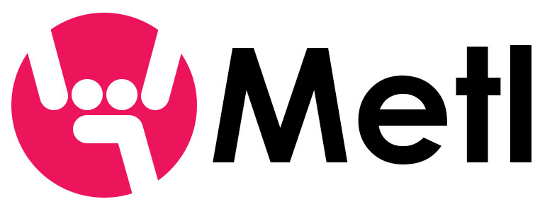
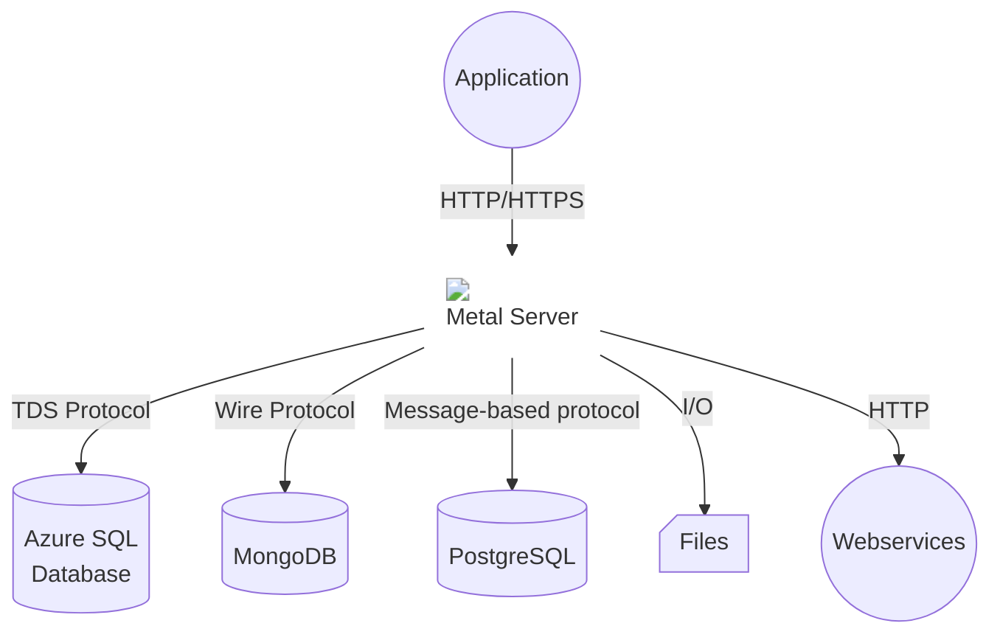

# 

## Overview

Metal (**M**iddleware, **E**xtraction, **T**ransformation, **A**rtificial Intelligence, and **L**oad) is an advanced technology that seamlessly merges artificial intelligence with database middleware and ETL functionalities, propelling enhanced performance and automating decision-making processes. 

It streamlines and modernizes CRUD operations and data transformation tasks across SQL and NoSQL databases, instigating a paradigm shift in data management and processing. Operating as an advanced middleware layer between the database system and HTTP requests, Metal manages communication with popular DBMS, particularly beneficial for systems like MS SQL Server and PostgreSQL that lack built-in REST APIs.

```mermaid
graph TD
M(<img src="https://metal-docs-sh3b0.kinsta.page/metal-logo-icon.png" width="50"/> Metal Server) -- TDS Protocol --> A[(Azure SQL <br>Database)]
M -- Wire Protocol --> B[(MongoDB)]
M -- Message-based protocol --> C[(PostgreSQL)]
M -- I/O --> F[Files]@{ shape: notch-rect, label: "Files" }
M -- HTTP --> W((Webservices))
U((Application)) -- HTTP/HTTPS --> M

style M fill:none,stroke:none
```

As a conduit between applications and the underlying DBMS, Metal accommodates various database operations, presenting a uniform interface for developers to construct and maintain applications that seamlessly interact with data. By abstracting complexities associated with direct DBMS engagement, Metal empowers developers to focus on core functionality, fostering productivity and manageability.

## Features

Metal offers a wide range of powerful features that empower developers and streamline data operations. With Metal, you can:

- **Modernize access to traditional database management systems**:  Metal provides a unified REST API that allows you to modernize the way you interact with popular database systems like MS SQL Server, PostgreSQL, MySQL, or MariaDB. By utilizing this API, you can seamlessly communicate with these systems, making the integration process simpler and more efficient.  

- **Virtualize schema**:  Metal enables you to virtualize schemas, allowing you to deliver different schema names and user credentials based on specific requirements. This flexibility ensures that your application can adapt to different environments or scenarios without the need for significant modifications.  

- **Merge schemas**:  Metal goes beyond traditional boundaries by allowing you to merge schemas from multiple databases and tables, even if they are from different database providers. This capability simplifies the process of working with distributed or heterogeneous data sources, providing a unified view for seamless data analysis and manipulation.  

- **Leverage Artificial Intelligence for Intelligent Insights**:  Through the integration of cutting-edge Artificial Intelligence, Metal empowers you to harness intelligent insights from your data. The AI-driven capabilities enable automatic identification of patterns, trends, and anomalies within your datasets. This feature unlocks the potential for data-driven decision-making and predictive analytics, transforming your data into a strategic asset.  

- **Secure your schema**: Metal prioritizes security by providing an additional login process and granular access control. You can enforce different levels of permissions per table, ensuring that your sensitive data remains protected and only accessible to authorized users or applications.  

- **Execute transformations on the fly**: Metal empowers you to perform data transformations effortlessly without the need to modify existing schemas. You can apply transformations dynamically at runtime, providing real-time data processing capabilities and eliminating the need for costly and time-consuming schema alterations.

These features collectively enhance the flexibility, security, and efficiency of your data operations, enabling you to modernize your approach to database management and data transformation while harnessing the power of Artificial Intelligence for advanced insights.

**List of principal features:**

 * REST API
 * SQL Servers support (Azure SQL Database, Microsoft SQL Server, PostgreSQL)
 * NoSQL Servers support (MongoDB)
 * Files as tables abstraction (JSON,CSV)
 * WebServices support (REST, SOAP)
 * Virtualize schema and deliver different schema names and user credentials
 * Merge schemas from multiple databases and tables, even from different data providers
 * Secure your schema with additional login processes and grant different rights per table
 * Execute transformations on the fly without modifying existing schemas

These features empower developers and simplify CRUD operations, data transformations, and integration with various database systems.

For additional details and comprehensive information, please consult the [Documentation](https://metal-docs-sh3b0.kinsta.page/).
