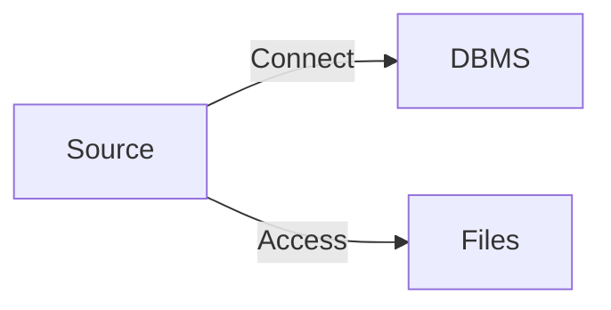
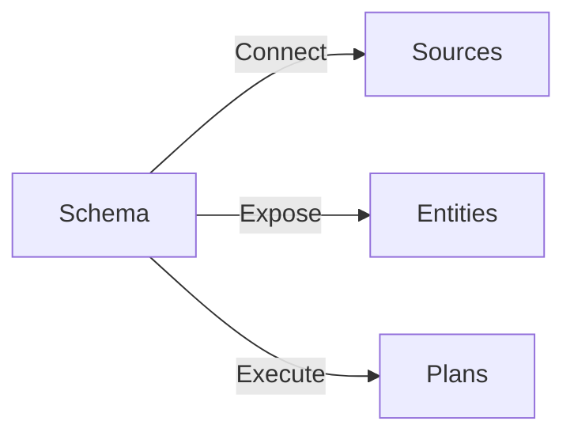
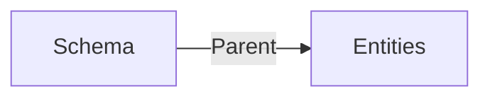
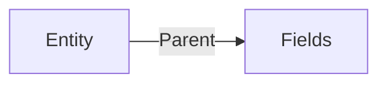
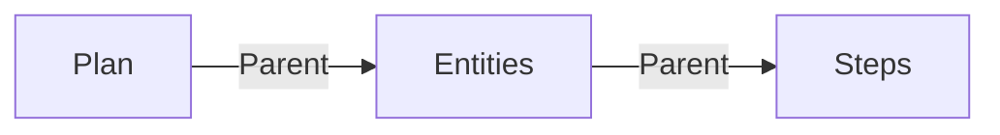
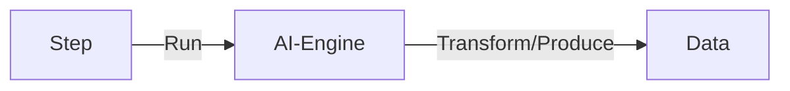
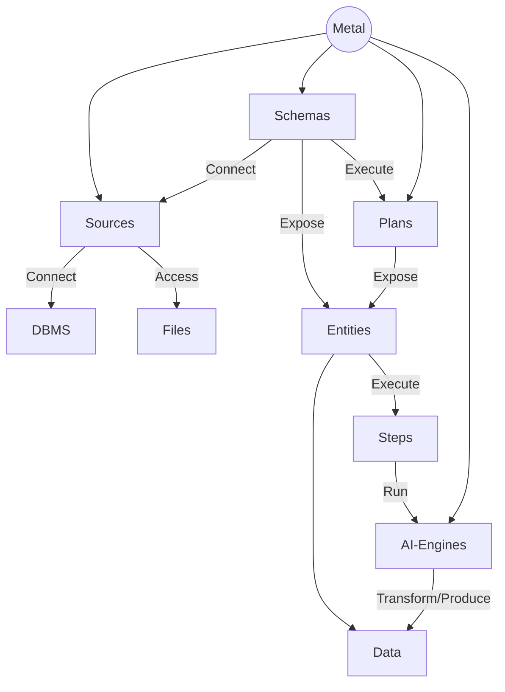
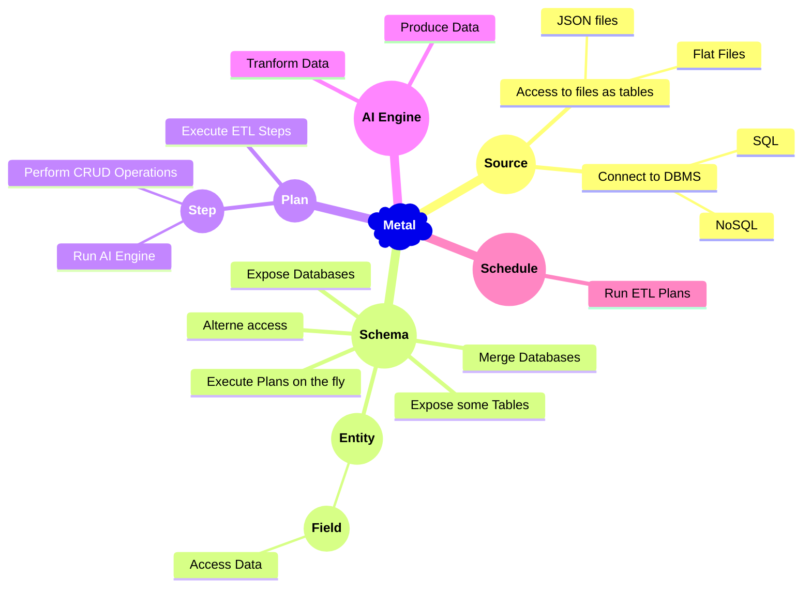

# What is Metal ?

Metal, abbreviated as **M**iddleware, **E**xtraction, **T**ransformation, **A**rtificial Intelligence and **L**oad, represents a cutting-edge technology that seamlessly integrates the capabilities of artificial intelligence with database middleware and ETL (Extraction, Transformation, Load) functionalities, ushering in a new era of enhanced performance. By infusing artificial intelligence, Metal elevates these functions, imbuing them with automation and intelligent decision-making capabilities.

The central mission of Metal remains unchanged: to streamline and modernize CRUD operations and data transformation tasks across a spectrum of SQL and NoSQL databases. However, with the infusion of artificial intelligence, Metal transcends traditional boundaries, introducing a paradigm shift in data management and processing.

Operating as a sophisticated middleware layer situated between the database system and HTTP requests, Metal orchestrates communication with popular DBMS seamlessly. This is particularly valuable for systems like MS SQL Server and PostgreSQL, which lack built-in REST APIs. With the infusion of artificial intelligence, Metal's middleware functionalities become more intuitive and adaptable, dynamically optimizing data flow and interaction patterns.

Beyond its exposed API, Metal harnesses the power of artificial intelligence to excel in intricate data transformations and amalgamations. Impressively, these transformations occur without necessitating modifications to existing schemas, even when dealing with disparate database providers. This flexibility ensures that the resulting datasets harmoniously align with the unique requisites of applications. Whether involving complex query construction or implementation of third-party ETL processes, Metal, empowered by artificial intelligence, adeptly manages all tasks, including dynamic caching and judicious data persistence.

Functioning as an indispensable conduit, Metal bridges the gap between applications and the underlying database management system (DBMS). Its feature-rich toolkit accommodates a myriad of database operations, spanning the creation, retrieval, update, and deletion of records.

A defining facet of Metal, enhanced by artificial intelligence, is its ability to streamline the interaction between applications and the DBMS. By presenting a uniform and consistent interface, Metal empowers developers to construct and sustain applications that seamlessly interact with and manipulate data stored within the database. By abstracting the intricacies associated with direct engagement with the DBMS, Metal empowers developers to focus on their application's core functionality, thereby fostering heightened productivity and manageability.

In essence, the infusion of artificial intelligence transforms Metal into an ingenious solution that seamlessly integrates middleware, ETL, and artificial intelligence. This convergence not only simplifies intricate processes but also propels data management and application development into an era of heightened intelligence and efficiency.

## Features

Metal offers a wide range of powerful features that empower developers and streamline data operations. With Metal, you can:

- **Modernize access to traditional database management systems**: Metal provides a unified REST API that allows you to modernize the way you interact with popular database systems like MS SQL Server, PostgreSQL, MySQL, or MariaDB. By utilizing this API, you can seamlessly communicate with these systems, making the integration process simpler and more efficient.

- **Virtualize schema**: Metal enables you to virtualize schemas, allowing you to deliver different schema names and user credentials based on specific requirements. This flexibility ensures that your application can adapt to different environments or scenarios without the need for significant modifications.

- **Merge schemas**: Metal goes beyond traditional boundaries by allowing you to merge schemas from multiple databases and tables, even if they are from different database providers. This capability simplifies the process of working with distributed or heterogeneous data sources, providing a unified view for seamless data analysis and manipulation.

- **Leverage Artificial Intelligence for Intelligent Insights**: Through the integration of cutting-edge Artificial Intelligence, Metal empowers you to harness intelligent insights from your data. The AI-driven capabilities enable automatic identification of patterns, trends, and anomalies within your datasets. This feature unlocks the potential for data-driven decision-making and predictive analytics, transforming your data into a strategic asset.

- **Secure your schema**: Metal prioritizes security by providing an additional login process and granular access control. You can enforce different levels of permissions per table, ensuring that your sensitive data remains protected and only accessible to authorized users or applications.

- **Execute transformations on the fly**: Metal empowers you to perform data transformations effortlessly without the need to modify existing schemas. You can apply transformations dynamically at runtime, providing real-time data processing capabilities and eliminating the need for costly and time-consuming schema alterations.

These features collectively enhance the flexibility, security, and efficiency of your data operations, enabling you to modernize your approach to database management and data transformation while harnessing the power of Artificial Intelligence for advanced insights.

**List of principal features:**

 * REST API
 * SQL Servers support (Microsoft SQL Server, PostgreSQL)
 * NoSQL Servers support (MongoDB)
 * Virtualize schema and deliver different schema names and user credentials
 * Merge schemas from multiple databases and tables, even from different providers
 * Secure your schema with additional login processes and grant different rights per table
 * Execute transformations on the fly without modifying existing schemas

These features empower developers and simplify CRUD operations, data transformations, and integration with various database systems.

## Understanding Metal Concepts

In the realm of Metal, where diverse database management systems (DBMS) and file sources coexist, unifying naming conventions stands as a crucial cornerstone. This unification ensures the preservation of a harmonious and consistent view of exposed data and objects, regardless of their origin or provider.

**Source**
The source represents the wellspring of data in Metal's ecosystem. It can take the form of a DBMS, be it SQL or NoSQL, a JSON file, or even a flat file. The source serves as the initial gateway through which data enters the Metal framework.

**Schema**
The schema, in Metal's context, acts as the facade that encompasses the database structure exposed to users. It provides a standardized and unified representation of the underlying data, simplifying the interaction and understanding of the database's structure.

**Entity**
Entities, akin to tables in traditional database terminology, are the building blocks of data organization within Metal. These entities represent distinct sets of related information and serve as the fundamental units for data management and retrieval.

**Field**
Fields, equivalent to columns in conventional databases, are the individual data attributes that make up an entity. They define the characteristics and properties of the data, enabling precise and granular data manipulation within Metal.

**Plan**
Plans within Metal encapsulate a predefined sequence of steps for conducting ETL (Extraction, Transformation, Load) operations. These plans facilitate the transformation and integration of data from diverse sources into a cohesive and structured format, enabling efficient data processing and analysis.

**AI Engine**
The AI Engine is a sophisticated component integrated into Metal's architecture. It harnesses the power of artificial intelligence to empower data-driven insights and decision-making. This engine automatically identifies patterns, trends, and anomalies within the data, enhancing the overall intelligence and functionality of the Metal platform. It acts as the catalyst for transforming raw data into strategic assets through intelligent analysis and predictive capabilities.

Here's below the whole Metal system :

## How it works

