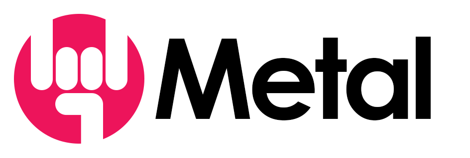

## **Table**
* What is Metal ?
* Features
* Getting started
* How to Install
* How to Configure
  * `config.yml`
    * `version`
    * `users`
    * `sources`
      * `driver`
      * `host`
      * `port`
      * `user`
      * `password`
      * `database`
      * `uri`
      * `options`
    * `schemas`
      * `source`
      * `access`
      * `tables`
        * `source`
* [REST API](rest_api.md)

## **What is Metal ?**
Metal (**M**iddleware, **E**xtraction, **T**ransformation and **L**oad) is a combination of data-oriented middleware and ETL (Extraction,Transformation,Load) specially designed to simplify and modernize CRUD and data transformation operations with most known SQL and NOSQL databases.

Metal stands as middleware from database system protocols to HTTP/REST API making communication with commonly known DBMS more simple, modern and unified especially for systems like MS SQL Server and PostgreSQL that by default does not provide a HTTP/HTTPS API.

In addition of the REST API, Metal can performs data transformation and data combinations operations without modifying existing schemas even with different database providers making dataset results as much as suitable for application. In case of writing queries, implementing third parties ETL, Metal does it at once on the fly and even caching and saving data when needed.

## **Features**
With Metal you can  :

**Modernize access** to traditional database management system like MS SQL Server, PostgreSQL, MySQL or MaridDB by providing an unified REST API.

**Virtualize schema** and deliver different schema name and different user credentials

**Merge schemas** from different databases, tables and even from different providers.

**Secure your schema** with additional login process and grant different rights per table

**Execute transformation on the fly** without modifying existing schemas

List of principal features:

* REST API
* Supports SQL Servers (Microsoft SQL Server,PostgreSQL)
* Supports NOSQL Servers (MongoDB)
* Anonymize access to Database Server
* Merge Databases
* Transform on the fly data without modifing existing data

## **Repository Structure**

This repository contains :

- `metal_server` --> Metal Server code source 
- `metal_client` --> JS Metal client 

## **Getting started**

## **Install**
[Install](install.md)

## **Configure**

> **Note:**
> For more details, see: [config.yml](config.yml.md)

  
  
  
  

