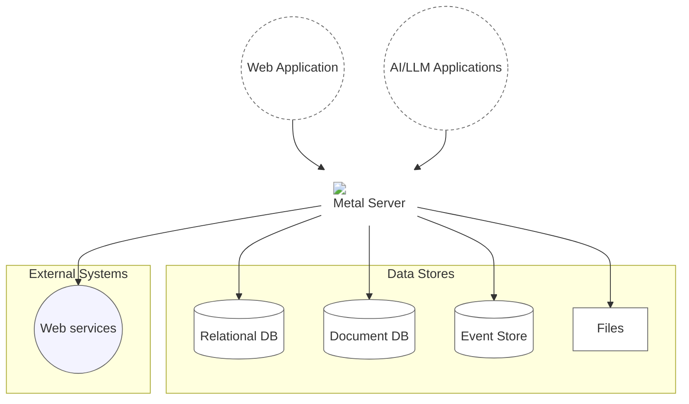

# Introduction

Metal (**M**iddleware, **E**xtraction, **T**ransformation, **A**rtificial Intelligence, and **L**oad) is a single server that sits between your applications and your databases, exposing SQL and NoSQL data through one REST API — and, natively, through MCP for AI agents.

It streamlines and modernizes CRUD operations and data transformation tasks across SQL and NoSQL databases, instigating a paradigm shift in data management and processing. Operating as an advanced middleware layer between the database system and HTTP requests, Metal manages communication with popular DBMS, particularly beneficial for systems like MS SQL Server and PostgreSQL that lack built-in REST APIs.

Going beyond traditional middleware, Metal natively speaks the Model Context Protocol (MCP) — the emerging standard that lets AI agents and LLM applications act directly on your data. With a simple declarative configuration, your schemas and entities become callable tools for the AI era, turning Metal into the bridge between your data and the AI agents that need to use it.

With its built-in MCP server, Metal extends this same abstraction to intelligent agents: AI assistants, chatbots, and automation pipelines can query, create, update, and manage your data through standardized MCP tools — secured by role-based access control, so you get the power of agentic data access without compromising security or control.

## Key Features

Metal offers a wide range of powerful features designed to enhance flexibility, security, and efficiency in data operations:

- **Unified REST API:** Modernize access to traditional database management systems like MS SQL Server, PostgreSQL, MySQL, or MariaDB through a unified REST API, simplifying integration processes.
  
- **Schema Virtualization:** Deliver different schema names and user credentials based on specific requirements, allowing your application to adapt to various environments without significant modifications.

- **Schema Merging:** Merge schemas from multiple databases and tables—even from different data providers—providing a unified view for seamless data analysis and manipulation.

- **AI-Powered Insights:** Leverage cutting-edge artificial intelligence to automatically identify patterns, trends, and anomalies within your datasets. This feature transforms raw data into strategic assets through intelligent insights.

- **MCP Server:** Expose Metal schemas and entities as MCP (Model Context Protocol) tools, enabling LLM clients and AI agents to read, create, update, delete, and list data through a declarative configuration.

- **Enhanced Security:** Prioritize security with an additional login process and granular access control. Enforce different levels of permissions per table and per MCP tool to protect sensitive data.

- **Dynamic Transformations:** Execute transformations on the fly without modifying existing schemas. This real-time processing capability eliminates the need for costly schema alterations.

## Benefits

By integrating an API with ETL capabilities, Metal provides numerous benefits:

- **Improved Productivity:** Developers can focus on core functionalities rather than dealing with complex database interactions.
  
- **Real-Time Data Processing:** With dynamic transformations and real-time access through the API, organizations can make timely decisions based on up-to-date information.

- **Scalability:** The architecture supports growing data needs efficiently without performance degradation.

- **Simplified Data Management:** A unified interface for diverse data sources simplifies CRUD operations and enhances overall data management practices.