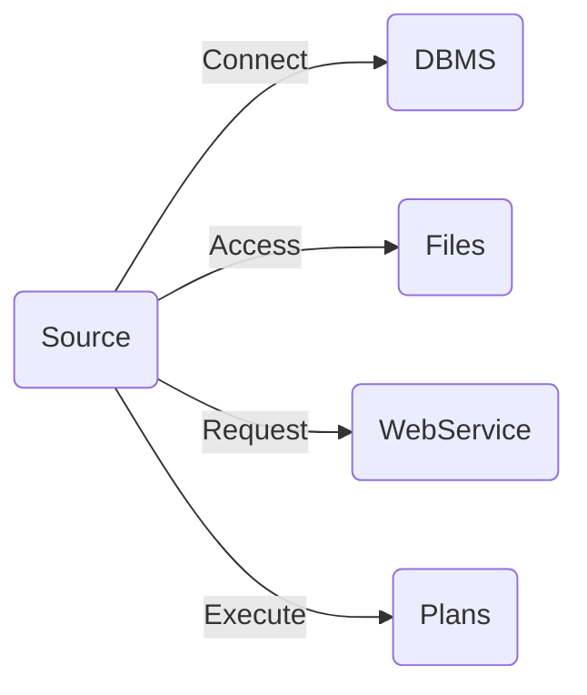
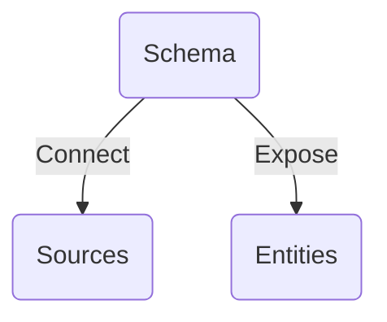
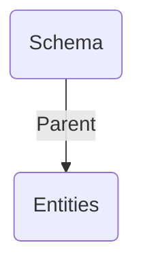
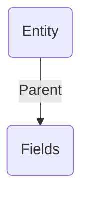
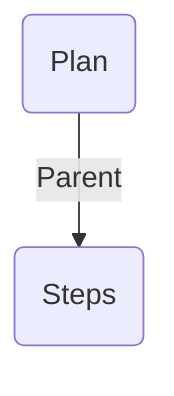
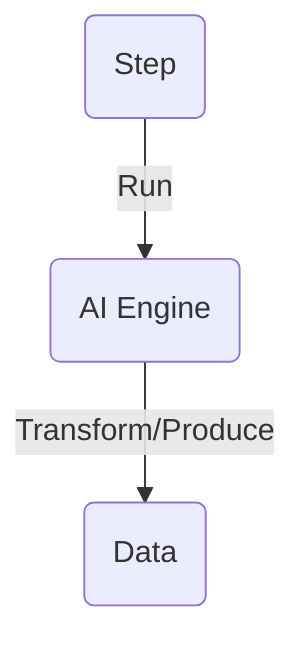
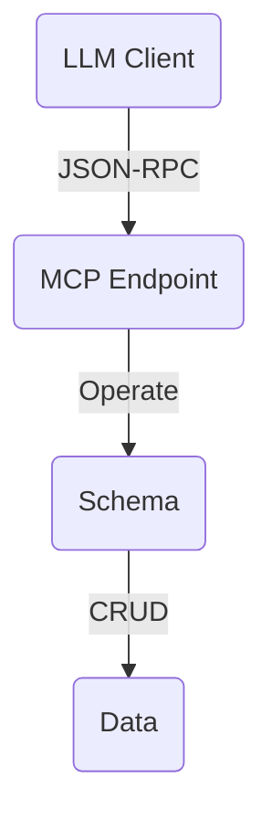

# Understanding Metal Concepts

In the realm of Metal, several key concepts facilitate effective data management:

- **Source:** Represents the origin of data, encompassing various sources such as DBMS (SQL or NoSQL), JSON files, or flat files, serving as the primary entry point for data ingestion into the Metal framework.

- **Schema:** Acts as a standardized representation of the underlying database structure exposed to users, simplifying interaction with the data.

- **Entity:** Similar to tables in traditional databases, entities represent distinct sets of related information within Metal.

- **Field:** Equivalent to columns in conventional databases, fields define individual data attributes within entities.

- **Plan:** Encapsulates predefined steps for conducting ETL operations, enabling efficient transformation and integration of diverse data sources into a cohesive format.

- **AI Engine:** A sophisticated component that harnesses artificial intelligence to enhance decision-making by identifying patterns and trends in data.

- **MCP Tool:** A declarative mapping between an LLM-friendly input shape and a Metal schema operation, exposed to AI clients through the Model Context Protocol endpoint.

Metal's comprehensive feature set empowers developers while simplifying CRUD operations and enabling efficient integration across various database systems. By harnessing the power of artificial intelligence for advanced insights, Metal transforms how organizations approach database management and data transformation.

## Source

::: half
The source represents the wellspring of data in Metal's ecosystem. 

It can take the form of a DBMS, be it SQL or NoSQL, a JSON file, or even a flat file. 

The source serves as the initial gateway through which data enters the Metal framework.

:::

::: half

:::

## Schema

::: half
The schema, in Metal's context, acts as the facade that encompasses the database structure exposed to users. 

It provides a standardized and unified representation of the underlying data, simplifying the interaction and understanding of the database's structure.

:::

::: half

:::

## Entity

::: half
Entities, akin to tables in traditional database terminology, are the building blocks of data organization within Metal. 

These entities represent distinct sets of related information and serve as the fundamental units for data management and retrieval.

:::

::: half

:::

## Field

::: half
Fields, equivalent to columns in conventional databases, are the individual data attributes that make up an entity. 

They define the characteristics and properties of the data, enabling precise and granular data manipulation within Metal.

:::

::: half

:::

## Plan

::: half
Plans within Metal encapsulate a predefined sequence of steps for conducting ETL (Extraction, Transformation, Load) operations. 

These plans facilitate the transformation and integration of data from diverse sources into a cohesive and structured format, enabling efficient data processing and analysis.

:::

::: half

:::

## AI Engine

::: half
The AI Engine is a sophisticated component integrated into Metal's architecture. 

It harnesses the power of artificial intelligence to empower data-driven insights and decision-making. 

This engine automatically identifies patterns, trends, and anomalies within the data, enhancing the overall intelligence and functionality of the Metal platform. It acts as the catalyst for transforming raw data into strategic assets through intelligent analysis and predictive capabilities.

:::

::: half

:::

## MCP Tool

::: half
The MCP Tool exposes Metal schemas and entities to LLM clients through the Model Context Protocol. 

Each tool maps an LLM-friendly input shape to a schema operation (`read`, `create`, `update`, `delete`, or `list`) and is protected by role-based access control.

:::

::: half

:::