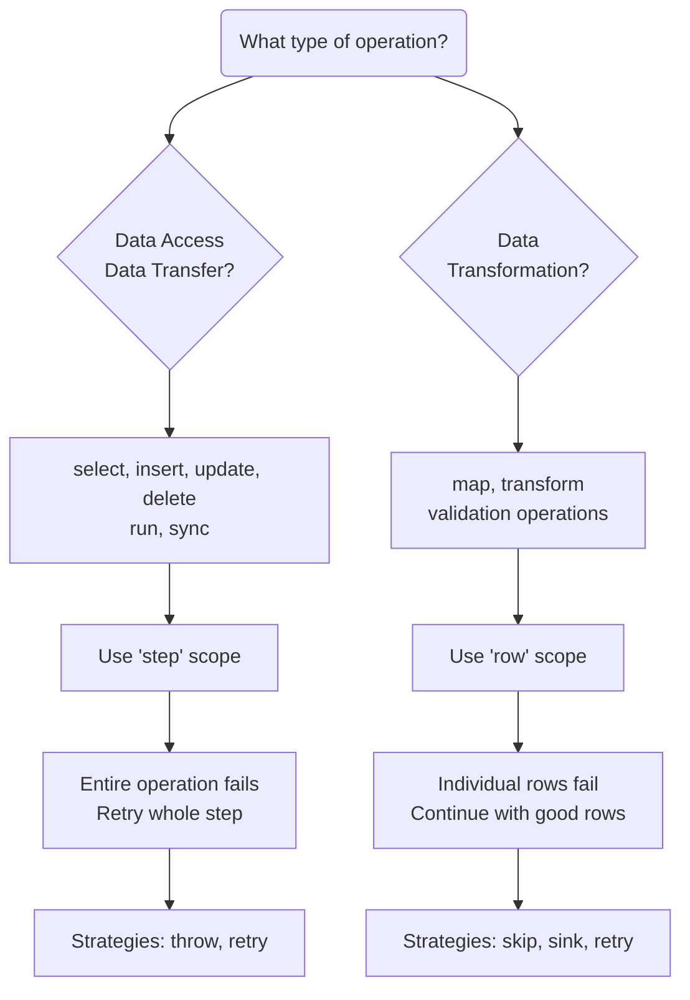

# Error Handling Configuration

The `on-error` parameter provides robust error handling for plan steps in Metal. This feature allows configurable error strategies to handle failures gracefully during data processing operations.

Error handling can be configured at two levels:

| Level          | Description                                           |
| -------------- | ----------------------------------------------------- |
| **Plan-Level** | Default for entire plan execution.                    |
| **Step-Level** | Specific to an individual step. Overrides plan-level. |

**Examples:**

Plan-Level Error Handling

> ```yaml
> plans:
>   my-plan:
>     on-error:
>       strategy: throw
>       scope: step
> ```

Step-Level Error Handling

> ```yaml
> plans:
>   my-plan:
>     steps:
>       - select:
>           schema: source
>           entity: data
>           on-error:
>             strategy: skip
>             scope: step
> ```

`on-error` has following parameters:

| Parameter  | Type   | Required | Description                                       | Metal Version                      |
| ---------- | ------ | -------- | ------------------------------------------------- | ---------------------------------- |
| `strategy` | String | Y        | Error handling strategy (`throw`, `skip`, `sink`) | <Badge type="info" text="v0.5+" /> |
| `scope`    | String | N        | Error scope: `step` or `row`                      | <Badge type="info" text="v0.5+" /> |
| `sink`     | Object | N        | Error sink configuration (for `sink` strategy)    | <Badge type="info" text="v0.5+" /> |
| `retry`    | Object | N        | Retry configuration (for `throw` strategy)        | <Badge type="info" text="v0.5+" /> |

If `on-error` is not specified in a plan, Metal will default to `throw` strategy and `step` scope as following:

> ```yaml
> plans:
>   my-plan:
>     on-error:             // [!code warning]
>       strategy: throw     // [!code warning]
>       scope: step         // [!code warning]
> ```

## `scope`

The `scope` parameter determines whether error handling applies to the entire step or individual rows:

- **`step`**: Error handling applies to the entire step operation. If the step fails, the whole step is retried/failed.
- **`row`**: Error handling applies to individual rows within the step. Failed rows are handled separately, successful rows continue.

## `strategy` <Badge type="info" text="v0.5+" />

The `strategy` parameter defines how Metal should handle errors when they occur during plan execution:

- `throw`: Stops plan execution and throws the error, allowed at step scope because row‑level errors are expected and should not abort the whole step.
- `sink`: Moves failed data to a specified error destination for later analysis and reprocessing, only allowed at row scope because error sinks are intended to capture individual failing rows, not entire step states.
- `retry`: Retries the failed operation with configurable settings, allowed at both scopes, but the behavior differs (step‑retry vs row‑retry).
- `skip`: Skips the failed operation and continues with next steps.

Here how strategy can be matched with scopes:

| Strategy | Step             | Row              |
| -------- | ---------------- | ---------------- |
| `throw`  | ✅               | ❌               |
| `skip`   | ✅               | ✅               |
| `sink`   | ❌               | ✅               |
| `retry`  | ✅<sup>(1)</sup> | ✅<sup>(2)</sup> |

> ✅: Supported
> ❌: Not supported
> (1): retry with sink is not supported
> (2): retry with throw is not supported

### `throw` <Badge type="info" text="v0.5+" />

Default behavior. Stops plan execution and throws the error.

**Example:**

> ```yaml
> on-error:
>   strategy: throw
>   scope: step
> ```

### `skip` <Badge type="info" text="v0.5+" />

Skips the failed operation and continues with next steps. For row-level operations, skips problematic rows.

**Parameters:** None

**Example:**

> ```yaml
> on-error:
>   strategy: skip
>   scope: step
> ```

### `sink` <Badge type="info" text="v0.5+" />

Moves failed data to a specified error destination for later analysis and reprocessing.

**Parameters:**

| Parameter       | Type    | Required | Description                                             | Metal Version                      |
| --------------- | ------- | -------- | ------------------------------------------------------- | ---------------------------------- |
| `schema`        | String  | Y        | Error destination schema                                | <Badge type="info" text="v0.5+" /> |
| `entity`        | String  | Y        | Error destination entity                                | <Badge type="info" text="v0.5+" /> |
| `include-error` | Boolean | N        | Include error details in sink (default: `true`)         | <Badge type="info" text="v0.5+" /> |
| `error-field`   | String  | N        | Field name for error details (default: `error-details`) | <Badge type="info" text="v0.5+" /> |

**Example:**

> ```yaml
> on-error:
>   strategy: sink
>   scope: row
>   sink:
>     schema: errors
>     entity: transform_failures
>     include-error: true
>     error-field: error_message
> ```

### `retry` <Badge type="info" text="v0.5+" />

Attempts to retry the failed operation, then applies a fallback strategy after retries.

**Parameters:**

| Parameter       | Type    | Required | Description                                                                     | Metal Version                      |
| --------------- | ------- | -------- | ------------------------------------------------------------------------------- | ---------------------------------- |
| `attempts`      | Integer | Y        | Maximum retry attempts including initial calls (default: `1`)                   | <Badge type="info" text="v0.5+" /> |
| `delay`         | Integer | N        | Delay between retries in milliseconds (default: `1000`)                         | <Badge type="info" text="v0.5+" /> |
| `backoff`       | String  | N        | Backoff strategy: `fixed`, `linear`, `exponential` (default: `fixed`)           | <Badge type="info" text="v0.5+" /> |
| `max-delay`     | Integer | N        | Maximum delay for exponential/linear backoff in milliseconds (default: `30000`) | <Badge type="info" text="v0.5+" /> |
| `after-retries` | String  | N        | Fallback strategy after retries: `throw`, `sink`, or `skip` (default: `throw`)  | <Badge type="info" text="v0.5+" /> |

::: warning ⚠️ IMPORTANT
For `after-retries`=`sink`, you need to complete the sink configuration. Please see [sink](#sink)
:::

**Example:**

> ```yaml
> on-error:
>   strategy: retry
>   scope: step
>   retry:
>     attempts: 5
>     delay: 2000
>     backoff: exponential
>     max-delay: 60000
>     after-retries: sink
>   sink:
>     schema: errors
>     entity: retry_failures
> ```

## Error Context Variable

When errors occur, context variable `$error` is available with the following properties:

| Variable       | Description                 | Available In                          |
| -------------- | --------------------------- | ------------------------------------- |
| `message`      | Error message text          | All strategies and scopes             |
| `type`         | Error type/classification   | All strategies and scopes             |
| `step.index`   | Step index that failed      | All strategies and scopes             |
| `step.command` | Step command that failed    | All strategies and scopes             |
| `step.params`  | Step parameters that failed | All strategies and scopes             |
| `timestamp`    | When error occurred         | All strategies and scopes             |
| `attempt`      | Number of retry attempts    | Retry strategies (step and row scope) |

## Error Sink Schema

Error sink destinations receive the original row fields plus error metadata:

| Field               | Type   | Description                                                                                            |
| ------------------- | ------ | ------------------------------------------------------------------------------------------------------ |
| _[original fields]_ | Mixed  | All original row fields are preserved directly                                                         |
| `error-details`     | Object | Error information including message, type, step context, timestamp, attempt (if `include-error: true`) |

### `error-details`

The `error-details` field contains the same structure as the context variable `$error`:

```json
{
  "error-details": {
    "message": "Invalid email format",
    "type": "ValidationError",
    "timestamp": "2024-01-15T10:30:45.123Z",
    "attempt": 2,
    "step": {
      "index": 1,
      "command": "map",
      "params": {
        "script": "$row.email = $row.email.toLowerCase();"
      }
    }
  }
}
```

**Mapping to context variables:**

- `error-details.message` → Error message text
- `error-details.type` → Error type/classification
- `error-details.step.index` → Step that failed (index)
- `error-details.step.command` → Step that failed (command)
- `error-details.step.params` → Step parameters that failed
- `error-details.timestamp` → When error occurred
- `error-details.attempt` → Current retry attempt

## Implementation Examples

### Step Scope vs Row Scope Comparison

#### Step Scope Example (Data Access)

> ```yaml
> plans:
>   data-pipeline:
>     steps:
>       - select:
>           schema: source
>           entity: customers
>           on-error:
>             strategy: retry
>             retry:
>               attempts: 3
>               delay: 1000
>               after-retries: throw
>
>       # If database connection fails, entire select operation
>       # is retried 3 times, then execution stops
> ```

#### Row Scope Example (Data Transformation)

> ```yaml
> plans:
>   data-pipeline:
>     steps:
>       - map:
>           script: |
>             $row.email = $row.email.toLowerCase().trim();
>             if (!$row.email.includes('@')) {
>               throw new Error('Invalid email format');
>             }
>             return $row;
>           on-error:
>             strategy: sink
>             scope: row # Default for map
>             sink:
>               schema: errors
>               entity: invalid_emails
>
>       # Individual rows with invalid emails are sunk,
>       # valid rows continue processing
> ```

### Basic Error Handling

> ```yaml
> plans:
>   data-pipeline:
>     steps:
>       - select:
>           schema: source
>           entity: raw_data
>           on-error:
>             strategy: skip
>
>       - map:
>           script: |
>             $row.processed_at = new Date().toISOString();
>             return $row;
>           on-error:
>             strategy: sink
>             sink:
>               schema: errors
>               entity: map_failures
>
>       - insert:
>           schema: target
>           entity: processed_data
>           on-error:
>             strategy: retry
>             retry:
>               attempts: 3
>               delay: 1000
>               after-retries: throw
> ```

### Advanced Error Handling with Retry and Sink

> ```yaml
> plans:
>   critical-pipeline:
>     steps:
>       - select:
>           schema: external_api
>           entity: data
>           on-error:
>             strategy: retry
>             retry:
>               attempts: 5
>               delay: 2000
>               backoff: exponential
>               max-delay: 60000
>               after-retries: sink
>             sink:
>               schema: errors
>               entity: api_failures
>               include-error: true
>
>       - map:
>           script: |
>             $row.normalized = $row.value.toLowerCase().trim();
>             return $row;
>           on-error:
>             strategy: skip
> ```

## Choosing the Right Scope



**Use `step` scope when:**

- Performing data access operations (select, insert, update, delete)
- Running external operations (AI engines, sync)
- Connection or infrastructure failures affect the entire operation
- You need to retry the complete operation

**Use `row` scope when:**

- Transforming or validating individual data rows
- Data quality issues affect only some rows
- You want to continue processing valid rows
- You need to capture specific problematic rows for analysis
