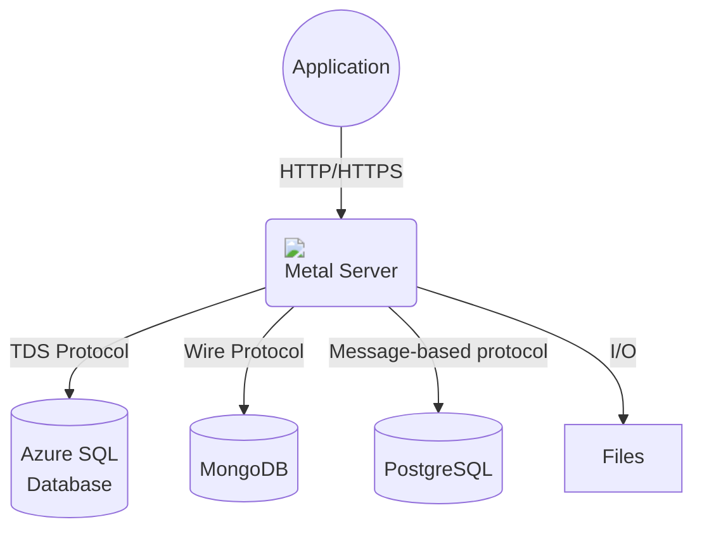
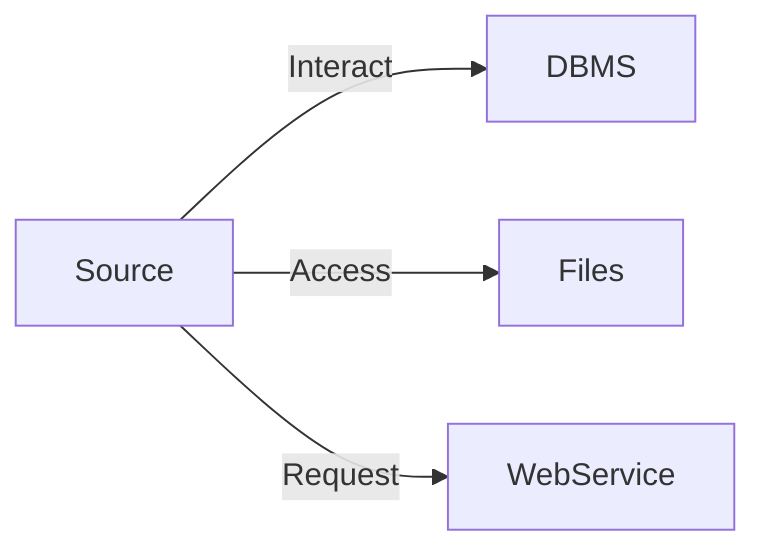
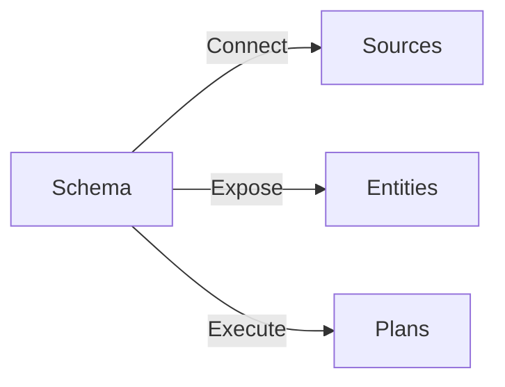
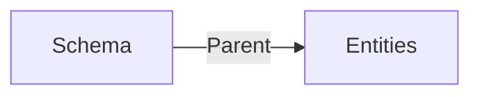
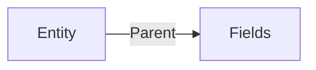
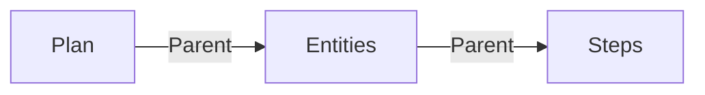
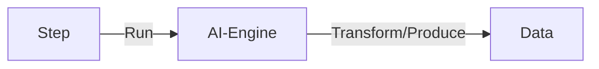
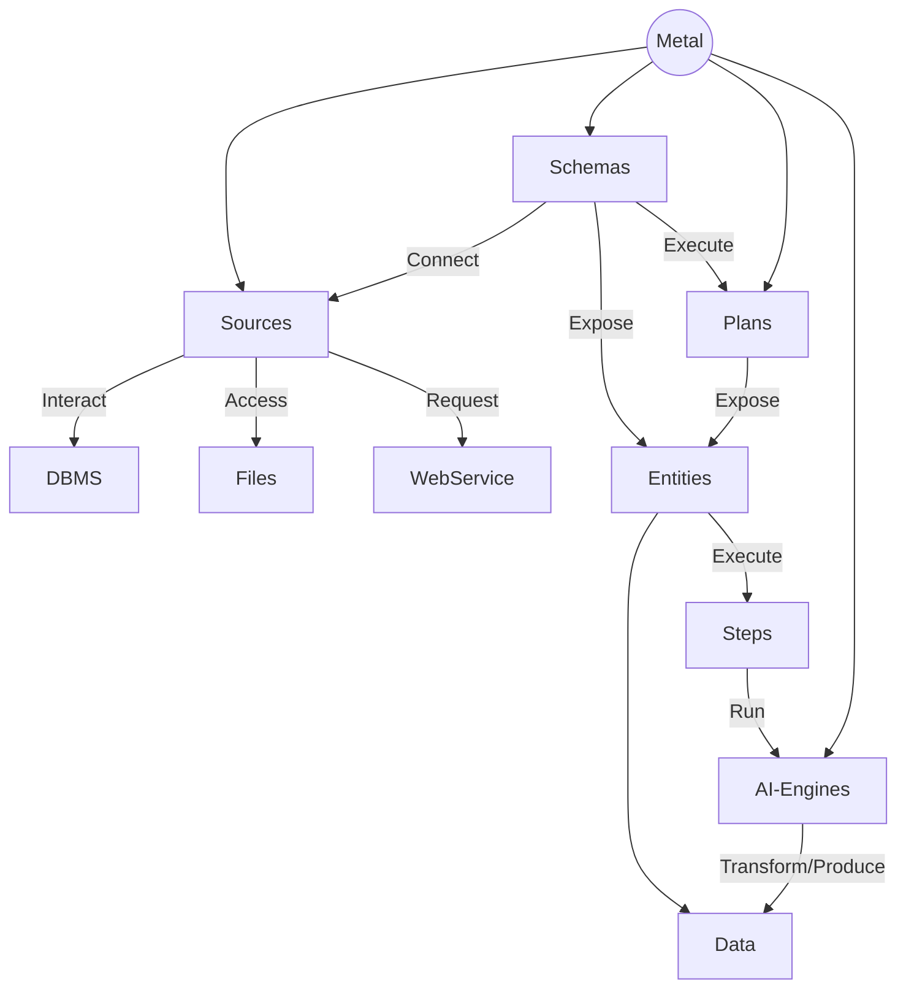
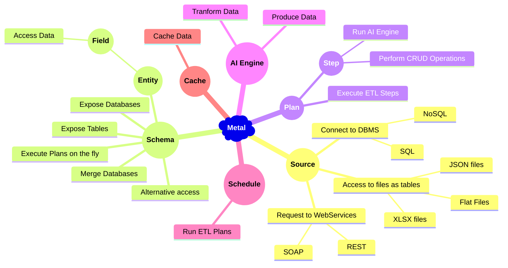

# About Metal

Metal (**M**iddleware, **E**xtraction, **T**ransformation, **A**rtificial Intelligence, and **L**oad) is an advanced technology that seamlessly merges artificial intelligence with database middleware and ETL functionalities, propelling enhanced performance and automating decision-making processes. 

It streamlines and modernizes CRUD operations and data transformation tasks across SQL and NoSQL databases, instigating a paradigm shift in data management and processing. Operating as an advanced middleware layer between the database system and HTTP requests, Metal manages communication with popular DBMS, particularly beneficial for systems like MS SQL Server and PostgreSQL that lack built-in REST APIs.

As a conduit between applications and the underlying DBMS, Metal accommodates various database operations, presenting a uniform interface for developers to construct and maintain applications that seamlessly interact with data. By abstracting complexities associated with direct DBMS engagement, Metal empowers developers to focus on core functionality, fostering productivity and manageability.

## Key Features

Metal offers a wide range of powerful features designed to enhance flexibility, security, and efficiency in data operations:

- **Unified REST API:** Modernize access to traditional database management systems like MS SQL Server, PostgreSQL, MySQL, or MariaDB through a unified REST API, simplifying integration processes.
  
- **Schema Virtualization:** Deliver different schema names and user credentials based on specific requirements, allowing your application to adapt to various environments without significant modifications.

- **Schema Merging:** Merge schemas from multiple databases and tables—even from different data providers—providing a unified view for seamless data analysis and manipulation.

- **AI-Powered Insights:** Leverage cutting-edge artificial intelligence to automatically identify patterns, trends, and anomalies within your datasets. This feature transforms raw data into strategic assets through intelligent insights.

- **Enhanced Security:** Prioritize security with an additional login process and granular access control. Enforce different levels of permissions per table to protect sensitive data.

- **Dynamic Transformations:** Execute transformations on the fly without modifying existing schemas. This real-time processing capability eliminates the need for costly schema alterations.

## Benefits

By integrating an API with ETL capabilities, Metal provides numerous benefits:

- **Improved Productivity:** Developers can focus on core functionalities rather than dealing with complex database interactions.
  
- **Real-Time Data Processing:** With dynamic transformations and real-time access through the API, organizations can make timely decisions based on up-to-date information.

- **Scalability:** The architecture supports growing data needs efficiently without performance degradation.

- **Simplified Data Management:** A unified interface for diverse data sources simplifies CRUD operations and enhances overall data management practices.

## Understanding Metal Concepts

In the realm of Metal, several key concepts facilitate effective data management:

- **Source:** Represents the origin of data, encompassing various sources such as DBMS (SQL or NoSQL), JSON files, or flat files, serving as the primary entry point for data ingestion into the Metal framework.

- **Schema:** Acts as a standardized representation of the underlying database structure exposed to users, simplifying interaction with the data.

- **Entity:** Similar to tables in traditional databases, entities represent distinct sets of related information within Metal.

- **Field:** Equivalent to columns in conventional databases, fields define individual data attributes within entities.

- **Plan:** Encapsulates predefined steps for conducting ETL operations, enabling efficient transformation and integration of diverse data sources into a cohesive format.

- **AI Engine:** A sophisticated component that harnesses artificial intelligence to enhance decision-making by identifying patterns and trends in data.

Metal's comprehensive feature set empowers developers while simplifying CRUD operations and enabling efficient integration across various database systems. By harnessing the power of artificial intelligence for advanced insights, Metal transforms how organizations approach database management and data transformation.

**Source**

The source represents the wellspring of data in Metal's ecosystem. It can take the form of a DBMS, be it SQL or NoSQL, a JSON file, or even a flat file. The source serves as the initial gateway through which data enters the Metal framework.

**Schema**

The schema, in Metal's context, acts as the facade that encompasses the database structure exposed to users. It provides a standardized and unified representation of the underlying data, simplifying the interaction and understanding of the database's structure.

**Entity**

Entities, akin to tables in traditional database terminology, are the building blocks of data organization within Metal. These entities represent distinct sets of related information and serve as the fundamental units for data management and retrieval.

**Field**

Fields, equivalent to columns in conventional databases, are the individual data attributes that make up an entity. They define the characteristics and properties of the data, enabling precise and granular data manipulation within Metal.

**Plan**

Plans within Metal encapsulate a predefined sequence of steps for conducting ETL (Extraction, Transformation, Load) operations. These plans facilitate the transformation and integration of data from diverse sources into a cohesive and structured format, enabling efficient data processing and analysis.

**AI Engine**

The AI Engine is a sophisticated component integrated into Metal's architecture. It harnesses the power of artificial intelligence to empower data-driven insights and decision-making. This engine automatically identifies patterns, trends, and anomalies within the data, enhancing the overall intelligence and functionality of the Metal platform. It acts as the catalyst for transforming raw data into strategic assets through intelligent analysis and predictive capabilities.

Here's below the whole Metal system :

## How it works

